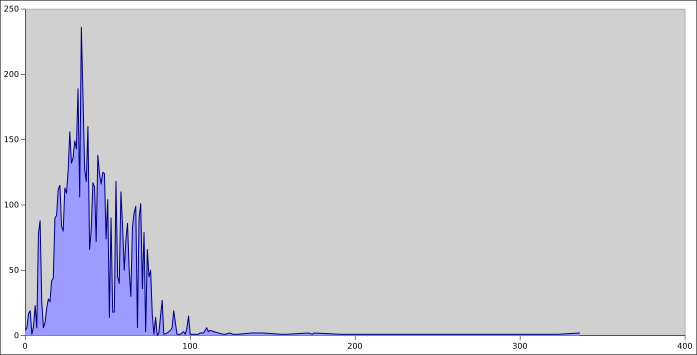

Genetic molecular clock
=======================
Compute large-scale molecular clock statistics using UniProt, the Paleobiology
Database, and the European Nucleotide Archive.

Ancestor age vs Clock rate
--------------------------

Counted rate
------------

